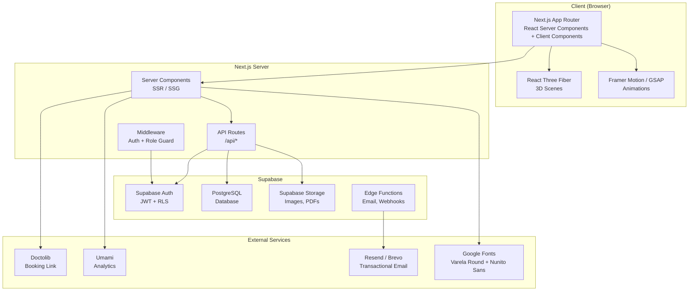
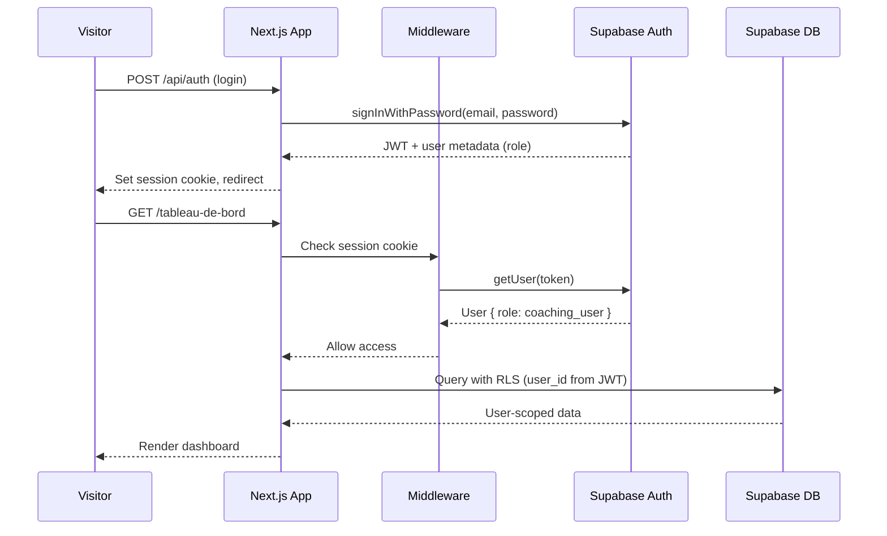
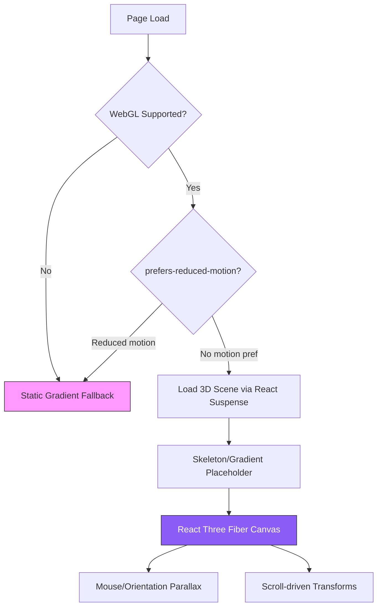

# Design Document — Aline Nebout Platform

## Overview

The Aline Nebout Platform is a multi-universe professional website built with Next.js (App Router) and Supabase, serving as the digital hub for an osteopathy practice, archaic reflex education, running form coaching, and the Pôle Santé de Rochetaillée-sur-Saône. The platform replaces a basic Google Sites website with an immersive, 3D-enhanced experience following a Soft UI Evolution aesthetic.

### Key Design Goals

- **Immersive visual identity**: 3D scenes (React Three Fiber), scroll-driven animations (Framer Motion/GSAP), and a pink-to-purple gradient palette create a premium first impression on each universe landing page.
- **Multi-universe architecture**: Three distinct content universes (Ostéopathie, Réflexes Archaïques, Coaching Foulée) plus a Pôle Santé hub share a common layout, navigation, auth system, and design system while maintaining their own content and features.
- **Progressive engagement**: Visitors browse public content → register for workshops (guest or account) → create an account for the coaching connected space → practitioners manage profiles and community.
- **Role-based access**: Three roles (coaching_user, practitioner, admin) with Supabase RLS enforcing data isolation.
- **Performance-first 3D**: Lazy-loaded WebGL scenes with graceful degradation, respecting `prefers-reduced-motion` and non-WebGL devices.
- **Local SEO**: SSR/SSG for all public pages, structured data (LocalBusiness, Article), sitemap, and Open Graph for social sharing.

### Technical Stack

| Layer | Technology |
|-------|-----------|
| Framework | Next.js 14+ (App Router, React Server Components) |
| Backend / Auth / DB | Supabase (Auth, PostgreSQL, Storage, Edge Functions) |
| Styling | Tailwind CSS 3.4+ with custom design tokens |
| 3D Rendering | React Three Fiber (`@react-three/fiber`) + Drei (`@react-three/drei`) |
| Animations | Framer Motion (scroll-driven, layout) + GSAP ScrollTrigger (complex timelines) |
| Fonts | Varela Round (headings) + Nunito Sans (body) via `next/font/google` |
| Charts | Recharts (progress tracking) |
| Email | Supabase Edge Functions + Resend or Brevo SMTP |
| Analytics | Umami (self-hosted, privacy-compliant) |
| Maps | Leaflet / react-leaflet (OpenStreetMap) or Google Maps Embed |
| i18n | next-intl (French default, structure-ready) |

---

## Architecture

### High-Level Architecture



### Next.js App Router Page Structure

```
app/
├── layout.tsx                    # Root layout: fonts, metadata, nav, footer, cookie banner
├── page.tsx                      # Home / landing page (redirect or combined hero)
├── globals.css                   # Tailwind + design tokens
│
├── (public)/                     # Public route group (SSR/SSG)
│   ├── osteopathie/
│   │   ├── page.tsx              # Osteopathy landing (Req 2)
│   │   └── [specialty]/
│   │       └── page.tsx          # Specialty pages (Req 3)
│   │
│   ├── reflexes/
│   │   ├── page.tsx              # Reflexes landing (Req 7)
│   │   ├── parents/
│   │   │   └── page.tsx          # Parent outreach (Req 7b.1-4)
│   │   ├── ecoles/
│   │   │   └── page.tsx          # Schools outreach (Req 7b.5-10)
│   │   ├── articles/
│   │   │   ├── page.tsx          # Article index + filtering (Req 9)
│   │   │   └── [slug]/
│   │   │       └── page.tsx      # Individual reflex article (Req 8)
│   │
│   ├── coaching/
│   │   ├── page.tsx              # Coaching public landing (Req 10)
│   │   └── ateliers/
│   │       └── page.tsx          # Workshop calendar + registration (Req 13)
│   │
│   ├── pole-sante/
│   │   ├── page.tsx              # Pôle Santé hub / practitioner directory (Req 28)
│   │   ├── praticiens/
│   │   │   └── [slug]/
│   │   │       └── page.tsx      # Practitioner profile (Req 29)
│   │   └── locations/
│   │       ├── page.tsx          # Rental listings (Req 32)
│   │       └── [id]/
│   │           └── page.tsx      # Rental detail + inquiry form (Req 32.3-5)
│   │
│   ├── blog/
│   │   ├── page.tsx              # Blog index + category filter (Req 23)
│   │   └── [slug]/
│   │       └── page.tsx          # Blog article (Req 23.4-6)
│   │
│   ├── a-propos/
│   │   └── page.tsx              # About page (Req 4)
│   ├── contact/
│   │   └── page.tsx              # Contact page (Req 6)
│   ├── mentions-legales/
│   │   └── page.tsx              # Legal notice (Req 20.3)
│   └── politique-confidentialite/
│       └── page.tsx              # Privacy policy (Req 20.2)
│
├── (auth)/                       # Auth route group
│   ├── connexion/
│   │   └── page.tsx              # Login (Req 11.3)
│   ├── inscription/
│   │   └── page.tsx              # Registration (Req 11.1-2)
│   └── mot-de-passe-oublie/
│       └── page.tsx              # Password reset (Req 11.7)
│
├── (dashboard)/                  # Authenticated route group (coaching_user)
│   ├── layout.tsx                # Dashboard layout with sidebar nav
│   ├── tableau-de-bord/
│   │   └── page.tsx              # User dashboard (Req 12)
│   ├── exercices/
│   │   ├── page.tsx              # Exercise programs list (Req 14.1)
│   │   └── [programId]/
│   │       └── page.tsx          # Program detail (Req 14.2-4)
│   └── progression/
│       └── page.tsx              # Progress tracking (Req 15)
│
├── (practitioner)/               # Practitioner route group
│   ├── layout.tsx                # Practitioner layout
│   ├── mon-profil/
│   │   └── page.tsx              # Profile management (Req 30.1)
│   └── communaute/
│       └── page.tsx              # Community space (Req 31)
│
├── (admin)/                      # Admin route group
│   ├── layout.tsx                # Admin layout with sidebar
│   ├── admin/
│   │   ├── page.tsx              # Admin dashboard (Req 34)
│   │   ├── praticiens/
│   │   │   └── page.tsx          # Practitioner management (Req 30.4)
│   │   ├── locations/
│   │   │   └── page.tsx          # Rental management (Req 33)
│   │   ├── ateliers/
│   │   │   └── page.tsx          # Workshop management (Req 13.8)
│   │   ├── communaute/
│   │   │   └── page.tsx          # Community moderation (Req 31.8)
│   │   ├── blog/
│   │   │   └── page.tsx          # Blog/content management (Req 23)
│   │   ├── temoignages/
│   │   │   └── page.tsx          # Testimonial management (Req 26.3)
│   │   └── newsletter/
│   │       └── page.tsx          # Newsletter subscribers (Req 25)
│
├── api/                          # API routes
│   ├── auth/
│   │   └── callback/
│   │       └── route.ts          # Supabase auth callback
│   ├── workshops/
│   │   ├── route.ts              # CRUD workshops
│   │   └── [id]/
│   │       ├── register/
│   │       │   └── route.ts      # Workshop registration
│   │       └── cancel/
│   │           └── route.ts      # Booking cancellation
│   ├── newsletter/
│   │   └── route.ts              # Newsletter subscribe/unsubscribe
│   ├── contact/
│   │   └── route.ts              # School contact form + rental inquiry
│   ├── lead-capture/
│   │   └── route.ts              # Parent guide download
│   ├── community/
│   │   └── route.ts              # Community posts CRUD
│   └── admin/
│       └── [...path]/
│           └── route.ts          # Admin API routes
│
└── sitemap.ts                    # Dynamic sitemap generation (Req 17.3)
```

### Authentication and Authorization Flow



**Role Matrix:**

| Route Group | coaching_user | practitioner | admin |
|-------------|:---:|:---:|:---:|
| Public pages | ✅ | ✅ | ✅ |
| Dashboard (coaching) | ✅ | ❌ | ✅ |
| Practitioner profile mgmt | ❌ | ✅ | ✅ |
| Community space | ❌ | ✅ | ✅ |
| Admin panel | ❌ | ❌ | ✅ |
| Workshop registration | ✅ (+ guest) | ✅ | ✅ |

### 3D Integration Strategy



**Design decisions for 3D:**

1. **Lazy loading**: Each `<Canvas>` is wrapped in `React.lazy()` + `<Suspense>` with a gradient placeholder matching the scene's color palette. This prevents 3D bundles from blocking LCP.
2. **Per-universe scenes**: Each universe has a unique 3D concept — organic flowing shape (osteopathy), neural network nodes (reflexes), running motion trail (coaching). Scenes are separate code-split chunks.
3. **Graceful degradation**: A `useWebGLSupport()` hook checks `WebGLRenderingContext` availability. Combined with `useReducedMotion()` from Framer Motion, the system falls back to static CSS gradient backgrounds with the same pink-to-purple palette.
4. **Performance budget**: 3D scenes target < 50KB gzipped per scene. Geometries use low-poly meshes (< 5K vertices). Textures are avoided in favor of shader-based materials using the design system colors.
5. **Mouse/orientation parallax**: Desktop uses `onPointerMove` with damped lerp (factor 0.05). Mobile uses `DeviceOrientationEvent` with the same damping. Both update camera position, not object position, for smoother results.

---

## Components and Interfaces

### Shared Components

```typescript
// components/layout/Navigation.tsx
interface NavigationProps {
  currentUniverse?: 'osteopathie' | 'reflexes' | 'coaching' | 'pole-sante';
}
// Fixed floating navbar with logo, universe links, auth button
// Collapses to hamburger on mobile (< 768px)
// Highlights active universe with gradient underline

// components/layout/Footer.tsx
interface FooterProps {}
// Social links (Instagram, Facebook, LinkedIn)
// Newsletter subscription form
// Legal links (mentions légales, politique de confidentialité)
// Contact info + Doctolib link

// components/layout/CookieConsent.tsx
interface CookieConsentProps {
  onAccept: () => void;
  onReject: () => void;
}
// GDPR-compliant banner, blocks analytics until accepted

// components/layout/Breadcrumb.tsx
interface BreadcrumbProps {
  items: Array<{ label: string; href?: string }>;
}
```

### 3D Scene Components

```typescript
// components/3d/WebGLGuard.tsx
interface WebGLGuardProps {
  children: React.ReactNode;
  fallback: React.ReactNode; // Static gradient fallback
}
// Checks WebGL support + prefers-reduced-motion
// Wraps React.lazy + Suspense for the 3D scene

// components/3d/OsteopathyScene.tsx
// Animated organic flowing shape with pink-to-purple gradient material
// Responds to mouse position with damped parallax

// components/3d/ReflexesScene.tsx
// Three interconnected 3D sphere nodes (motor, emotional, cognitive)
// Rotatable by user interaction

// components/3d/CoachingScene.tsx
// Running figure silhouette or motion trail
// Scroll-driven animation

// components/3d/ParticleBackground.tsx
// Subtle animated particle field for hero section backgrounds
// Uses instanced mesh for performance
```

### Animation Components

```typescript
// components/animation/ScrollReveal.tsx
interface ScrollRevealProps {
  children: React.ReactNode;
  direction?: 'up' | 'down' | 'left' | 'right';
  delay?: number;
  stagger?: number; // For child elements
}
// Framer Motion wrapper for scroll-triggered reveals

// components/animation/TiltCard.tsx
interface TiltCardProps {
  children: React.ReactNode;
  className?: string;
  maxTilt?: number; // degrees, default 8
}
// CSS perspective transform based on cursor position
// 200-300ms smooth transition

// components/animation/PageTransition.tsx
// Crossfade/slide animation between universe pages (300-500ms)
```

### Content Components

```typescript
// components/content/SpecialtyCard.tsx
interface SpecialtyCardProps {
  title: string;
  description: string;
  icon: React.ReactNode;
  href: string;
}
// Card with hover tilt effect, links to specialty page

// components/content/ReflexArticleCard.tsx
interface ReflexArticleCardProps {
  title: string;
  excerpt: string;
  spheres: Array<'motor' | 'emotional' | 'cognitive'>;
  slug: string;
}
// Card with sphere color indicators

// components/content/BlogArticleCard.tsx
interface BlogArticleCardProps {
  title: string;
  excerpt: string;
  category: 'osteopathie' | 'reflexes' | 'coaching';
  publishedAt: string;
  featuredImage?: string;
  slug: string;
}

// components/content/TestimonialCard.tsx
interface TestimonialCardProps {
  firstName: string;
  serviceType: string;
  text: string;
  rating?: number; // 1-5
}

// components/content/PractitionerCard.tsx
interface PractitionerCardProps {
  name: string;
  profession: string;
  photo?: string;
  shortDescription: string;
  slug: string;
}
```

### Form Components

```typescript
// components/forms/WorkshopRegistrationForm.tsx
interface WorkshopRegistrationFormProps {
  workshopId: string;
  workshopDate: string;
  remainingSpots: number;
}
// Fields: name, email, phone, optional message
// Guest or authenticated registration

// components/forms/SchoolContactForm.tsx
interface SchoolContactFormProps {}
// Fields: school name, contact person, email, phone,
// request type (info session | workshop | screening), message

// components/forms/RentalInquiryForm.tsx
interface RentalInquiryFormProps {
  rentalSpaceId: string;
}
// Fields: name, email, phone, desired period, message

// components/forms/NewsletterForm.tsx
interface NewsletterFormProps {
  variant: 'footer' | 'inline'; // Compact vs expanded
}
// Email field + GDPR consent checkbox

// components/forms/LeadCaptureForm.tsx
interface LeadCaptureFormProps {}
// Email field for parent guide PDF download

// components/forms/SelfAssessmentChecklist.tsx
interface SelfAssessmentChecklistProps {
  items: Array<{ id: string; label: string }>;
  threshold: number; // Number of checks to trigger CTA (default 3)
  onThresholdReached: () => void;
}
```

### Dashboard Components

```typescript
// components/dashboard/SessionSummary.tsx
interface SessionSummaryProps {
  upcomingSessions: Workshop[];
  recentSessions: SessionRecord[];
}

// components/dashboard/ExerciseProgram.tsx
interface ExerciseProgramProps {
  program: ExerciseProgram;
  completions: ExerciseCompletion[];
  onComplete: (exerciseId: string) => void;
}

// components/dashboard/ProgressChart.tsx
interface ProgressChartProps {
  data: ProgressDataPoint[];
  metric: 'completion_rate' | 'sessions' | 'exercises';
}
// Recharts line/area chart with design system colors

// components/dashboard/StatsCards.tsx
interface StatsCardsProps {
  totalSessions: number;
  totalExercises: number;
  activeWeeks: number;
}
```

### Booking Component

```typescript
// components/booking/DoctolibButton.tsx
interface DoctolibButtonProps {
  variant?: 'primary' | 'secondary';
  label?: string;
}
// Opens Doctolib URL in new tab
// Default label: "Prendre rendez-vous sur Doctolib"
```

### Community Components

```typescript
// components/community/PostFeed.tsx
interface PostFeedProps {
  posts: CommunityPost[];
  currentFilter?: PostCategory;
  onFilterChange: (category: PostCategory | null) => void;
}

// components/community/PostCard.tsx
interface PostCardProps {
  post: CommunityPost;
  onComment: (content: string) => void;
}

// components/community/PostEditor.tsx
interface PostEditorProps {
  categories: PostCategory[];
  onSubmit: (post: NewPostPayload) => void;
  allowAttachments?: boolean;
}
```

---

## Data Models

### Supabase Database Schema

```mermaid
erDiagram
    AUTH_USERS ||--o| PROFILES : has
    PROFILES ||--o{ WORKSHOP_BOOKINGS : makes
    PROFILES ||--o{ EXERCISE_COMPLETIONS : records
    PROFILES ||--o{ COMMUNITY_POSTS : authors
    PROFILES ||--o{ COMMUNITY_COMMENTS : writes
    PROFILES ||--o| PRACTITIONER_PROFILES : manages

    WORKSHOPS ||--o{ WORKSHOP_BOOKINGS : receives
    WORKSHOPS ||--o{ WORKSHOP_WAITLIST : has

    EXERCISE_PROGRAMS ||--o{ EXERCISES : contains
    EXERCISE_PROGRAMS ||--o{ PROGRAM_ASSIGNMENTS : assigned_via
    PROFILES ||--o{ PROGRAM_ASSIGNMENTS : receives
    EXERCISES ||--o{ EXERCISE_COMPLETIONS : tracked_by

    COMMUNITY_POSTS ||--o{ COMMUNITY_COMMENTS : has
    COMMUNITY_POSTS ||--o{ POST_ATTACHMENTS : has

    RENTAL_SPACES ||--o{ RENTAL_INQUIRIES : receives

    BLOG_ARTICLES ||--o{ BLOG_ARTICLES : related_to

    PROFILES {
        uuid id PK "References auth.users.id"
        text full_name
        text email
        enum role "coaching_user | practitioner | admin"
        text phone
        text avatar_url
        timestamptz created_at
        timestamptz updated_at
    }

    PRACTITIONER_PROFILES {
        uuid id PK
        uuid user_id FK "References profiles.id"
        text profession
        text description
        text[] specialties
        text phone
        text email
        text booking_url
        text photo_url
        text office_location
        text slug "URL-friendly name"
        boolean is_published
        timestamptz created_at
        timestamptz updated_at
    }

    WORKSHOPS {
        uuid id PK
        timestamptz date
        text time_display "e.g. 18h20"
        text location
        int max_capacity "10-12"
        int current_count
        enum status "upcoming | full | completed | cancelled"
        text notes
        uuid created_by FK
        timestamptz created_at
    }

    WORKSHOP_BOOKINGS {
        uuid id PK
        uuid workshop_id FK
        uuid user_id FK "Nullable for guest bookings"
        text guest_name
        text guest_email
        text guest_phone
        text message
        enum status "confirmed | cancelled | waitlisted"
        text cancel_token "UUID for email cancellation link"
        timestamptz created_at
    }

    WORKSHOP_WAITLIST {
        uuid id PK
        uuid workshop_id FK
        text email
        text name
        int position
        timestamptz created_at
    }

    EXERCISE_PROGRAMS {
        uuid id PK
        text title
        text description
        uuid created_by FK "Admin who created it"
        timestamptz created_at
    }

    EXERCISES {
        uuid id PK
        uuid program_id FK
        text name
        text description
        int repetitions
        text instructional_notes
        int sort_order
    }

    PROGRAM_ASSIGNMENTS {
        uuid id PK
        uuid program_id FK
        uuid user_id FK
        timestamptz assigned_at
    }

    EXERCISE_COMPLETIONS {
        uuid id PK
        uuid exercise_id FK
        uuid user_id FK
        timestamptz completed_at
    }

    COMMUNITY_POSTS {
        uuid id PK
        uuid author_id FK
        enum category "annonce | ressource | question | evenement"
        text title
        text content
        boolean is_pinned
        timestamptz created_at
        timestamptz updated_at
    }

    COMMUNITY_COMMENTS {
        uuid id PK
        uuid post_id FK
        uuid author_id FK
        text content
        timestamptz created_at
    }

    POST_ATTACHMENTS {
        uuid id PK
        uuid post_id FK
        text file_name
        text file_url "Supabase Storage URL"
        text file_type "pdf | image"
        int file_size
        timestamptz created_at
    }

    RENTAL_SPACES {
        uuid id PK
        text name
        text description
        float surface_area
        text[] amenities
        jsonb pricing "{ hourly, daily, monthly }"
        text[] photo_urls
        enum status "available | occupied | maintenance"
        text tenant_name
        text tenant_period
        timestamptz created_at
        timestamptz updated_at
    }

    RENTAL_INQUIRIES {
        uuid id PK
        uuid rental_space_id FK
        text name
        text email
        text phone
        text desired_period
        text message
        enum status "new | contacted | confirmed | declined"
        timestamptz created_at
        timestamptz updated_at
    }

    BLOG_ARTICLES {
        uuid id PK
        text title
        text slug
        text excerpt
        text content "Markdown or rich text"
        enum category "osteopathie | reflexes | coaching"
        text featured_image_url
        boolean is_published
        uuid author_id FK
        timestamptz published_at
        timestamptz created_at
        timestamptz updated_at
    }

    REFLEX_ARTICLES {
        uuid id PK
        text name
        text slug
        text description
        text signs_of_non_integration
        text integration_approach
        text[] spheres "motor | emotional | cognitive"
        text content "Full article content"
        text image_url
        int sort_order
        timestamptz created_at
        timestamptz updated_at
    }

    TESTIMONIALS {
        uuid id PK
        text first_name
        enum service_type "osteopathie | reflexes | coaching"
        text review_text
        int rating "1-5, nullable"
        boolean is_published
        timestamptz created_at
    }

    NEWSLETTER_SUBSCRIBERS {
        uuid id PK
        text email
        boolean gdpr_consent
        boolean is_active
        text unsubscribe_token
        timestamptz subscribed_at
        timestamptz unsubscribed_at
    }

    LEAD_CAPTURES {
        uuid id PK
        text email
        text source "parent_guide | school_contact"
        jsonb metadata "Additional form data"
        timestamptz created_at
    }

    SCHOOL_INQUIRIES {
        uuid id PK
        text school_name
        text contact_name
        text email
        text phone
        enum request_type "information_session | workshop | screening"
        text message
        enum status "new | contacted | completed"
        timestamptz created_at
    }

    SPECIALTIES {
        uuid id PK
        text name
        text slug
        text description
        text indications
        text treatment_approach
        text image_url
        int sort_order
    }
```



### Row Level Security (RLS) Policies

| Table | Policy | Rule |
|-------|--------|------|
| `profiles` | Users read own profile | `auth.uid() = id` |
| `profiles` | Admin reads all | `role = 'admin'` |
| `workshop_bookings` | Users read own bookings | `auth.uid() = user_id` |
| `workshop_bookings` | Guest bookings via cancel_token | Public read with token match |
| `workshop_bookings` | Admin reads all | `role = 'admin'` |
| `exercise_completions` | Users read/write own | `auth.uid() = user_id` |
| `program_assignments` | Users read own | `auth.uid() = user_id` |
| `community_posts` | Practitioners + admin read all | `role IN ('practitioner', 'admin')` |
| `community_posts` | Authors update own | `auth.uid() = author_id` |
| `community_posts` | Admin delete any | `role = 'admin'` |
| `practitioner_profiles` | Public read published | `is_published = true` |
| `practitioner_profiles` | Owner updates own | `auth.uid() = user_id` |
| `rental_spaces` | Public read | All |
| `rental_spaces` | Admin write | `role = 'admin'` |
| `rental_inquiries` | Admin read all | `role = 'admin'` |
| `blog_articles` | Public read published | `is_published = true` |
| `blog_articles` | Admin write | `role = 'admin'` |
| `testimonials` | Public read published | `is_published = true` |
| `newsletter_subscribers` | Admin read | `role = 'admin'` |


---

## Correctness Properties

*A property is a characteristic or behavior that should hold true across all valid executions of a system — essentially, a formal statement about what the system should do. Properties serve as the bridge between human-readable specifications and machine-verifiable correctness guarantees.*

### Property 1: Content rendering completeness

*For any* content entity (specialty, reflex article, blog article, practitioner profile, or rental listing) with valid data, rendering the entity's display component should produce output containing every schema-required field (title/name, description/excerpt, and all entity-specific required fields such as spheres for reflex articles, category for blog articles, profession for practitioners, and amenities/pricing for rentals).

**Validates: Requirements 3.2, 8.2, 23.2, 29.1, 32.2**

### Property 2: Breadcrumb path correctness

*For any* content page with a hierarchical path (specialty pages, reflex articles, practitioner profiles), the breadcrumb component should render exactly N segments matching the page's hierarchy, where the last segment displays the entity's name and all preceding segments are clickable links to their respective parent pages.

**Validates: Requirements 3.4, 8.4, 29.4**

### Property 3: Collection filter and sort correctness

*For any* filterable collection (reflex articles by sphere, blog articles by category, practitioners by profession, community posts by category) and any valid filter value, the filtered results should contain exactly the items matching the filter criterion, no matching items should be excluded, and the results should maintain their defined sort order (reverse chronological for blog articles and community posts, sort_order for reflex articles and specialties).

**Validates: Requirements 9.2, 9.3, 23.3, 28.4, 31.2, 31.5**

### Property 4: Self-assessment checklist threshold

*For any* combination of checked items in the parent self-assessment checklist, the recommendation message and booking CTA should be displayed if and only if the count of checked items is greater than or equal to the configured threshold (default: 3). When the count is below the threshold, the recommendation should not be visible.

**Validates: Requirements 7b.3**

### Property 5: Sequential article navigation

*For any* ordered list of reflex articles and any article at position i, the "previous" link should point to the article at position i-1 (or be absent when i = 0), and the "next" link should point to the article at position i+1 (or be absent when i is the last position).

**Validates: Requirements 8.5**

### Property 6: Generic authentication error message

*For any* invalid credential combination (wrong email only, wrong password only, or both wrong), the authentication error message displayed to the user should be identical and should not reveal whether the email or the password was the incorrect field.

**Validates: Requirements 11.4**

### Property 7: Workshop booking capacity invariant

*For any* workshop with max_capacity M and current_count C where C < M, successfully registering a new participant should increase current_count to C + 1, create exactly one new booking record, and the displayed remaining spots should equal M - (C + 1). When C >= M, registration should be rejected and the workshop should display as "Complet" with a waitlist option.

**Validates: Requirements 13.1, 13.3, 13.5**

### Property 8: Workshop cancellation and waitlist promotion

*For any* workshop at full capacity with a non-empty waitlist, cancelling one confirmed booking should decrease current_count by exactly 1, change the cancelled booking's status to "cancelled", and promote the first person on the waitlist (lowest position) to a confirmed booking with notification.

**Validates: Requirements 13.6**

### Property 9: Exercise completion percentage

*For any* exercise program with N exercises (N > 0) and M completed exercises (0 ≤ M ≤ N), the displayed completion percentage should equal Math.round((M / N) * 100). When N = 0, the percentage should be 0.

**Validates: Requirements 14.4**

### Property 10: Progress statistics aggregation

*For any* set of session records and exercise completions for a user, the total sessions count should equal the number of distinct completed sessions, the total exercises count should equal the number of exercise completion records, and the active weeks count should equal the number of distinct ISO weeks containing at least one session or exercise completion.

**Validates: Requirements 15.3**

### Property 11: Public page meta tags

*For any* public page route on the platform, the rendered HTML head should contain non-empty values for: title, meta description, og:title, og:description, og:url, and og:image. The og:url should match the canonical URL of the page.

**Validates: Requirements 17.2, 22.3**

### Property 12: Row Level Security data isolation

*For any* two distinct authenticated users A and B, user A querying the database for user B's bookings, exercise completions, program assignments, or progress data should return zero rows. Each user should only be able to read and modify their own records.

**Validates: Requirements 18.2**

### Property 13: Error message safety

*For any* database error or server-side exception, the user-facing error message should not contain SQL keywords, table names, column names, stack traces, or Supabase internal error codes. The message should be a generic, user-friendly string.

**Validates: Requirements 18.5**

### Property 14: Related blog article suggestions

*For any* blog article with category C and a pool of other articles, the related article suggestions should contain only articles with the same category C, should exclude the current article, and should contain at most 3 items (or fewer if the pool has fewer than 3 matching articles).

**Validates: Requirements 23.6**

### Property 15: Role-based access control

*For any* user with a given role, access to protected route groups should be granted or denied according to the role matrix: coaching_user can access the coaching dashboard but not practitioner or admin areas; practitioner can access profile management and community space but not coaching dashboard or admin areas; admin can access all areas. Unauthorized access attempts should result in a redirect to the appropriate public page.

**Validates: Requirements 30.2, 31.1, 34.4**

### Property 16: Admin dashboard summary counts

*For any* state of the database, the admin dashboard summary cards should display counts that exactly match: the number of published practitioner profiles, the number of rental inquiries with status "new", the number of community posts created in the last 7 days, the number of active newsletter subscribers, and the number of published blog articles.

**Validates: Requirements 34.1**

### Property 17: Image accessibility

*For any* image rendered on the platform via the Image component or img tag, the alt attribute should be present and contain a non-empty, descriptive string (not a generic placeholder like "image" or "photo").

**Validates: Requirements 16.4**

---

## Error Handling

### Client-Side Error Handling

| Scenario | Behavior |
|----------|----------|
| **Network failure** | Display a toast notification "Connexion perdue. Veuillez réessayer." with a retry button. Cache form inputs in sessionStorage to prevent data loss. |
| **API 4xx errors** | Parse error response and display field-level validation messages on forms. For 401/403, redirect to login page. For 404, display a custom "Page introuvable" page. |
| **API 5xx errors** | Display a generic "Une erreur est survenue. Veuillez réessayer plus tard." message. Log error details to console in development, to server logs in production. Never expose stack traces or DB details (Property 13). |
| **Form validation** | Validate client-side before submission using Zod schemas. Display inline error messages below each invalid field. Disable submit button until all required fields are valid. |
| **3D scene failure** | If WebGL context is lost or scene fails to load, catch the error in an Error Boundary and render the static gradient fallback. Log the error silently. |
| **Image load failure** | Use Next.js Image `onError` to display a placeholder with the entity's initials or a generic icon. |
| **Auth token expiry** | Supabase client auto-refreshes tokens. If refresh fails, redirect to login with a "Session expirée" message. |

### Server-Side Error Handling

| Scenario | Behavior |
|----------|----------|
| **Supabase query failure** | Catch in API route, log full error (including SQL details) server-side, return generic 500 response to client. |
| **Email send failure** | Log error, store the email job in a retry queue (Supabase Edge Function with exponential backoff). Do not block the user action — return success for the primary operation (e.g., booking) and retry email asynchronously. |
| **File upload failure** | Return 413 for oversized files (max 10MB), 415 for unsupported types. Display specific error message to user. |
| **Rate limiting** | Apply rate limits on public form endpoints (newsletter, contact, registration): 5 requests per minute per IP. Return 429 with "Trop de requêtes. Veuillez patienter." |
| **Cascade delete failure** | Wrap user deletion in a database transaction. If any cascade step fails, roll back the entire operation and return an error. |

### Validation Strategy

All form inputs are validated at two levels:

1. **Client-side (Zod)**: Immediate feedback, prevents unnecessary API calls.
2. **Server-side (API route + Supabase constraints)**: Authoritative validation, prevents bypassing client checks.

Shared Zod schemas are defined in `lib/validations/` and imported by both client components and API routes to ensure consistency.

```typescript
// lib/validations/workshop-registration.ts
import { z } from 'zod';

export const workshopRegistrationSchema = z.object({
  name: z.string().min(2, "Le nom doit contenir au moins 2 caractères"),
  email: z.string().email("Adresse email invalide"),
  phone: z.string().regex(/^(?:(?:\+33|0)\s?[1-9])(?:[\s.-]?\d{2}){4}$/, "Numéro de téléphone invalide"),
  message: z.string().max(500).optional(),
});
```

---

## Testing Strategy

### Testing Approach

The platform uses a dual testing approach combining unit/example-based tests with property-based tests for comprehensive coverage.

### Test Stack

| Tool | Purpose |
|------|---------|
| **Vitest** | Test runner (fast, Vite-native, compatible with Next.js) |
| **fast-check** | Property-based testing library for TypeScript |
| **React Testing Library** | Component rendering and interaction testing |
| **MSW (Mock Service Worker)** | API mocking for integration tests |
| **Playwright** | End-to-end tests for critical user flows |

### Property-Based Tests (fast-check)

Each correctness property from the design document is implemented as a property-based test with a minimum of 100 iterations. Tests are tagged with the property they validate.

```typescript
// Example: Property 9 — Exercise completion percentage
import { fc } from 'fast-check';

// Feature: aline-nebout-platform, Property 9: Exercise completion percentage
test('completion percentage equals round(M/N * 100)', () => {
  fc.assert(
    fc.property(
      fc.integer({ min: 1, max: 50 }),  // N exercises
      fc.integer({ min: 0, max: 50 }),  // M completions
      (totalExercises, completedRaw) => {
        const completed = Math.min(completedRaw, totalExercises);
        const result = calculateCompletionPercentage(completed, totalExercises);
        expect(result).toBe(Math.round((completed / totalExercises) * 100));
      }
    ),
    { numRuns: 100 }
  );
});
```

**Property test coverage map:**

| Property | Test File | What It Tests |
|----------|-----------|---------------|
| P1: Content rendering | `__tests__/properties/content-rendering.test.tsx` | All 5 entity types render required fields |
| P2: Breadcrumb paths | `__tests__/properties/breadcrumb.test.tsx` | Hierarchy segments and links |
| P3: Filter + sort | `__tests__/properties/collection-filter.test.tsx` | 4 collection types filter/sort correctly |
| P4: Self-assessment threshold | `__tests__/properties/self-assessment.test.tsx` | Threshold logic for checklist |
| P5: Article navigation | `__tests__/properties/article-navigation.test.tsx` | Prev/next links at all positions |
| P6: Auth error message | `__tests__/properties/auth-error.test.tsx` | Generic error for all invalid combos |
| P7: Booking capacity | `__tests__/properties/workshop-booking.test.tsx` | Capacity increment/decrement/full |
| P8: Cancellation + waitlist | `__tests__/properties/workshop-cancel.test.tsx` | Spot freed, waitlist promoted |
| P9: Completion percentage | `__tests__/properties/completion-percentage.test.tsx` | Math correctness |
| P10: Progress stats | `__tests__/properties/progress-stats.test.tsx` | Aggregation correctness |
| P11: Meta tags | `__tests__/properties/meta-tags.test.tsx` | All public pages have required tags |
| P12: RLS isolation | `__tests__/properties/rls-isolation.test.tsx` | Cross-user data access denied |
| P13: Error safety | `__tests__/properties/error-safety.test.tsx` | No DB internals in messages |
| P14: Related articles | `__tests__/properties/related-articles.test.tsx` | Same category, excludes self, max 3 |
| P15: Role access | `__tests__/properties/role-access.test.tsx` | Role matrix enforcement |
| P16: Admin counts | `__tests__/properties/admin-counts.test.tsx` | Summary card accuracy |
| P17: Image alt text | `__tests__/properties/image-alt.test.tsx` | Non-empty descriptive alt |

### Unit / Example-Based Tests

Unit tests cover specific examples, edge cases, and integration points not suited for PBT:

| Area | Test Focus |
|------|-----------|
| **Navigation** | Active universe indicator, hamburger toggle, logo link |
| **Auth flows** | Registration, login, logout, password reset (mocked Supabase) |
| **Workshop forms** | Form validation, guest vs authenticated registration |
| **Dashboard states** | Empty state, with sessions, with programs |
| **3D fallback** | WebGL detection, reduced-motion fallback |
| **Cookie consent** | Banner display, accept/reject, analytics blocking |
| **Email templates** | Confirmation, reminder, notification content |
| **Admin CRUD** | Create/edit/archive for workshops, rentals, blog, practitioners |

### End-to-End Tests (Playwright)

Critical user journeys tested end-to-end:

1. **Visitor books osteopathy appointment**: Landing → Specialty → Doctolib (new tab)
2. **Parent self-assessment flow**: Reflexes → Parents → Check items → See recommendation → Book
3. **Workshop registration (guest)**: Coaching → Ateliers → Select date → Register → Confirmation
4. **Coaching user journey**: Register → Login → Dashboard → View exercises → Mark complete → Progress
5. **Practitioner profile management**: Login (practitioner) → Edit profile → Verify public page
6. **Admin workshop management**: Login (admin) → Create workshop → View registrants
7. **Blog browsing**: Blog index → Filter by category → Read article → See related articles

### Test Configuration

```typescript
// vitest.config.ts
export default defineConfig({
  test: {
    environment: 'jsdom',
    setupFiles: ['./tests/setup.ts'],
    include: ['**/*.test.{ts,tsx}'],
    coverage: {
      provider: 'v8',
      reporter: ['text', 'html'],
      exclude: ['components/3d/**'], // 3D scenes tested via E2E
    },
  },
});
```

### Performance Testing

- **Lighthouse CI**: Automated checks on public pages targeting score ≥ 90
- **3D performance**: Manual testing on mid-range mobile (Moto G Power) over throttled 4G to verify LCP < 2.5s with 3D scenes
- **Bundle analysis**: `@next/bundle-analyzer` to ensure 3D chunks are properly code-split and lazy-loaded
